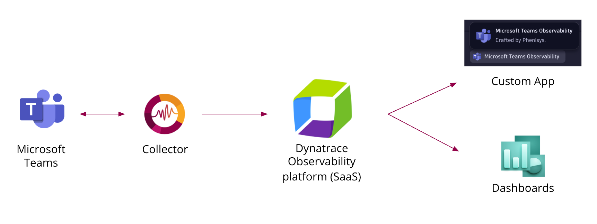

# MS Teams Observability App

The MS Teams Observability App for Dynatrace features a smart collector that refines call records and service‑health data from Microsoft Graph before sending it to your Dynatrace environment. It ships with ready‑to‑use visualizations so you can monitor Teams call quality and service status across your organization.

## Table of Contents

[Overview](#overview)  
[Prerequisites](#prerequisites)  
[Configuration Steps](#configuration-steps)  

## Overview

The collector connects to Microsoft Graph to retrieve:

- Call details (duration, participants, health)
- Media stream metadata 
- Service health and announcements  

**Data flow**  
Logs are sent to your Dynatrace tenant, processed by OpenPipeline, stored in a dedicated Grail bucket, and then visualized in the dedicated app.

  

## Prerequisites

- Azure AD Token or Certificate with following permissions:
  - CallRecords.Read.All
  - ServiceHealth.Read.All
  - Reports.Read.All
- Dynatrace SaaS
- VM Linux or Windows x64

## Configuration Steps

1. [Configure Azure Permissions](https://github.com/Phenisys/microsoft-teams-observability/wiki/Configure-Azure-Permissions)
2. [Install the MS Teams Observability App](https://github.com/Phenisys/microsoft-teams-observability/wiki/Install-the-MS-Teams-Observability-App)
3. [Configure your Dynatrace environment](https://github.com/Phenisys/microsoft-teams-observability/wiki/Configure-your-Dynatrace-environment)
4. [Deploy the Collector](https://github.com/Phenisys/microsoft-teams-observability/wiki/deploy-the-collector)