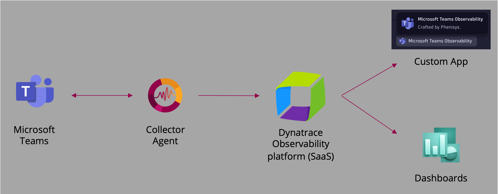
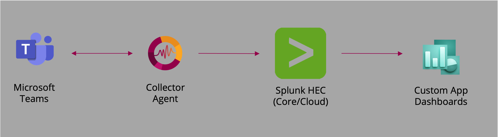

# MS Teams Observability

The MS Teams Observability Agent provides a smart collector that refines call metadata and service‑health data from Microsoft Graph API. 

It supports exporting enriched observability data to multiple backends including **Dynatrace** and **Splunk**. 
It ships with ready‑to‑use visualizations so you can monitor Teams call quality and service status across your organization.

Dynatrace Hub page for the [Dynatrace App](https://www.dynatrace.com/hub/detail/microsoft-teams-observability/).

Splunkbase page for the [Splunk App](https://splunkbase.splunk.com/app/7850/) (Coming soon).

## Table of Contents

- [Overview](#overview)
- [Dynatrace Visualizations](#dynatrace-visualizations)
- [Splunk Visualizations](#splunk-visualizations)
- [Prerequisites](#prerequisites)  
- [Configuration Steps](#configuration-steps--documentation)  

## Overview

The collector connects to Microsoft Graph to retrieve:
- Call Records
- PSTN Call Records
- Direct Routing Records
- Call Queue Records
- Auto Attendant Records
- MS Teams Service health and announcements

### Dynatrace Visualizations

#### Main page

#### Calls list

#### Call Details

#### MS Teams Published Issues

#### Teams performance by locations

#### Data flow for Dynatrace

MS Teams metadata are sent to your Dynatrace tenant, processed by OpenPipeline, stored in a dedicated Grail bucket, and then visualized in the dedicated app or dashboards.

  

### Splunk Visualizations

#### Main page

#### Site Quality

#### Call Details

#### Global Network Performance Assessment

#### Data flow for Splunk

MS Teams metadata are sent to your Splunk HEC and then visualized in your custom dashboards.

  

## Prerequisites

- Azure AD Token or Certificate with following permissions:
  - *CallRecords.Read.All*
  - *ServiceHealth.Read.All*
  - *Reports.Read.All*
- VM Ubuntu 22.04 x64 or Windows x64
- A supported Observability backend: 
  -	Dynatrace (via Grail/OpenPipeline)
  -	Splunk (via HTTP Event Collector)
  - And more to come!

## Configuration Steps & Documentation

Take a look at our frequently updated [Wiki](https://github.com/Phenisys/microsoft-teams-observability/wiki) for the latest information.
