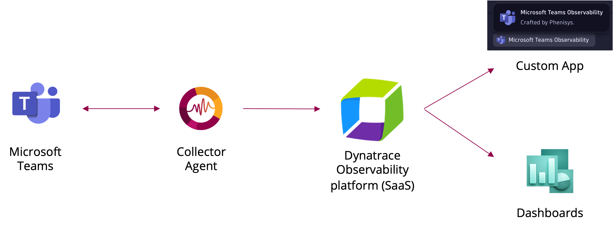
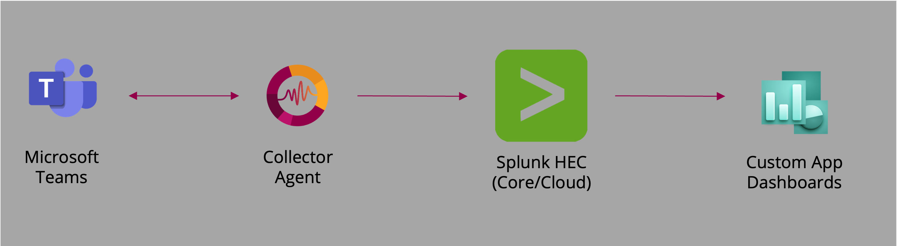

# MS Teams Observability

The MS Teams Observability Agent provides a smart collector that refines call metadata and service‑health data from Microsoft Graph API. It supports exporting enriched observability data to multiple backends including Dynatrace and Splunk. 
It ships with ready‑to‑use visualizations so you can monitor Teams call quality and service status across your organization.

Dynatrace Hub page for our [Dynatrace App](https://www.dynatrace.com/hub/detail/microsoft-teams-observability/).

## Table of Contents

[Overview](#overview)  
[Prerequisites](#prerequisites)  
[Configuration Steps](#configuration-steps)  

## Overview

The collector connects to Microsoft Graph to retrieve:
- Call Records
- PSTN Call Records
- Direct Routing Records
- MS Teams Service health and announcements

**Data flow for Dynatrace**

MS Teams metadata are sent to your Dynatrace tenant, processed by OpenPipeline, stored in a dedicated Grail bucket, and then visualized in the dedicated app or dashboards.

  

**Data flow for Splunk**

MS Teams metadata are sent to your Splunk HEC and then visualized in your custom dashboards.

  

## Prerequisites

- Azure AD Token or Certificate with following permissions:
  - *CallRecords.Read.All*
  - *ServiceHealth.Read.All*
  - *Reports.Read.All*
- VM Ubuntu 22.04 x64 or Windows x64
- A supported Observability backend: 
  -	Dynatrace (via Grail/OpenPipeline)
  -	Splunk (via HTTP Event Collector)
  - And more to come!

## Configuration Steps & Documentation

Take a look at our frequently updated [Wiki](https://github.com/Phenisys/microsoft-teams-observability/wiki) for the latest information.
