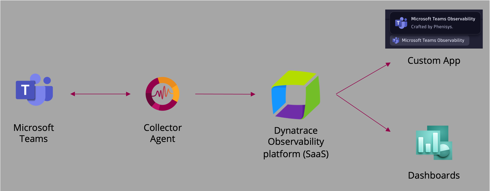
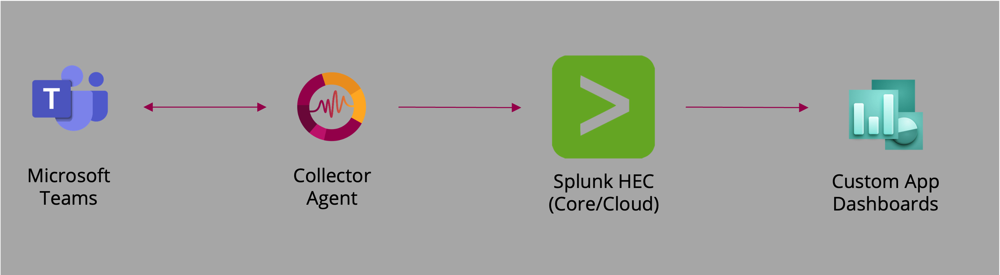

# Microsoft Teams Observability

**Microsoft Teams Observability** provides a collector for Microsoft Teams telemetry and service health data.

It connects to Microsoft Graph, collects and enriches Microsoft Teams observability data, and exports it to supported backends such as **Dynatrace** and **Splunk**.

This repository is the **core collector project** of the solution.

---

## What the collector does

The collector retrieves and processes Microsoft Teams observability data including:

- Call Records
- PSTN Call Records
- Direct Routing Records
- Call Queue Records
- Auto Attendant Records
- Microsoft Teams service health and announcements

It is designed to help teams monitor collaboration experience, investigate call quality issues, and feed backend-specific dashboards and troubleshooting workflows.

---

## Getting started

For prerequisites, installation, configuration, and backend integration, use the public documentation:

https://phenisys.github.io/microsoft-teams-observability-documentation/

This is the main entry point for deploying the collector and connecting it to your observability backend.

---

## Supported Backends

The collector can export Microsoft Teams observability data to multiple supported backends.

### Dynatrace

For Dynatrace, the collector sends Microsoft Teams observability data to Dynatrace, where it can be processed and visualized through the dedicated application and dashboards.

Related components:

- **Dynatrace Application**  
  https://github.com/Phenisys/microsoft-teams-observability-dynatrace-app

- **Dynatrace Extension**  
  https://github.com/Phenisys/microsoft-teams-observability-dynatrace-extension

- **Dynatrace Hub**  
  https://www.dynatrace.com/hub/detail/microsoft-teams-observability/

#### Dynatrace visualizations

##### Home

##### Sites

##### Calls

##### Users

##### Call Overview

##### Issues

##### Dynatrace data flow

Microsoft Teams metadata are sent to Dynatrace, processed for analysis and storage, and then visualized through the dedicated Dynatrace application and dashboards.

  

---

### Splunk

For Splunk, the collector exports Microsoft Teams observability data to Splunk for dashboarding and analytics.

#### Splunk visualizations

##### Home

##### Site Quality

##### Call Details

##### Global Network Performance Assessment

##### Splunk data flow

Microsoft Teams metadata are sent to Splunk and visualized through dedicated dashboards.

  

---

## Looking for the Dynatrace solution?

Many users arrive on this repository while looking for the Dynatrace components.

For Dynatrace, the solution includes:

- the **collector** — this repository
- the **Dynatrace Application** — ready-to-use dashboards and investigation views  
  https://github.com/Phenisys/microsoft-teams-observability-dynatrace-app
- the **Dynatrace Extension** — EF2 packaging and deployment for Dynatrace  
  https://github.com/Phenisys/microsoft-teams-observability-dynatrace-extension

---

## Which repository should I use?

- **I want to collect Microsoft Teams data**  
  → this repository

- **I want dashboards and investigation views in Dynatrace**  
  → https://github.com/Phenisys/microsoft-teams-observability-dynatrace-app

- **I want the Dynatrace EF2 extension package**  
  → https://github.com/Phenisys/microsoft-teams-observability-dynatrace-extension
